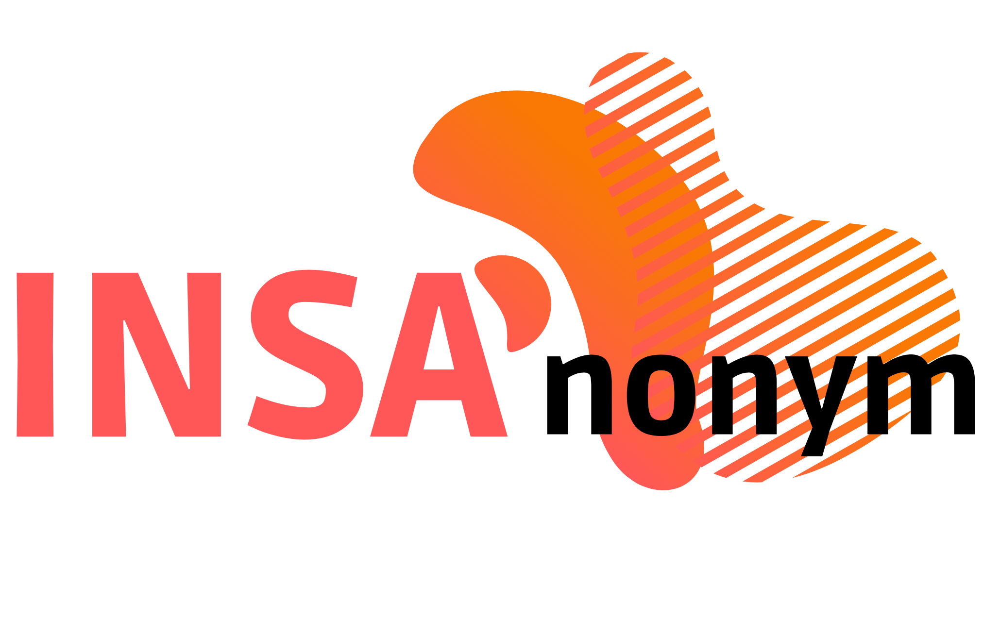

INS'Anonym-utils dispose d'une librarie capable d'effectuer des opérations sur une table, dans le but de l'anonymiser.

Pour l'instant, elle est capable de:

- Créer un dataframe à partir de la table.
- Effectuer plusieurs algorithmes simples sur la table en question
- Executer des algorithmes créés par l'utilisateur
- Exporter la dataframe au format choisi.

## Installation

L'installation est compatible sur la version `3.8` et `3.9` de python.

```bash
pip install insanonym-utils
```

Pour mettre à jour à la version la plus récente:
```bash
pip install insanonym-utils --upgrade
```
Les notes de mise à jour sont dans l'onglet [Releases](https://github.com/danymat/INSAnonym-utils/releases) de Github.

## Documentation

- [Premiers pas](https://github.com/danymat/INSAnonym-utils/blob/main/docs/premiers-pas.md)
- Pour connaitre les algorithmes fournis par la librairie, consulter la section [Algorithmes](docs/algorithmes.md).
- Pour comprendre comment ajouter son propre algorithme, consulter la section [Création d'algorithmes](docs/creation-algorithmes.md).
- Pour voir la documentation détaillée du code source, consulter le site [INSAnonym-utils](https://danymat.github.io/INSAnonym-utils).

## Development

Prérequis:

- [Poetry](https://python-poetry.org/docs/#installation)

```
git clone https://github.com/danymat/INSAnonym-utils.git
cd INSAnonym-utils
poetry install 
```

Run the tests:
```bash
cd tests
poetry run pytest
```

## Roadmap

La roadmap se situe ici: [Roadmap](https://github.com/danymat/INSAnonym-utils/projects/1).
